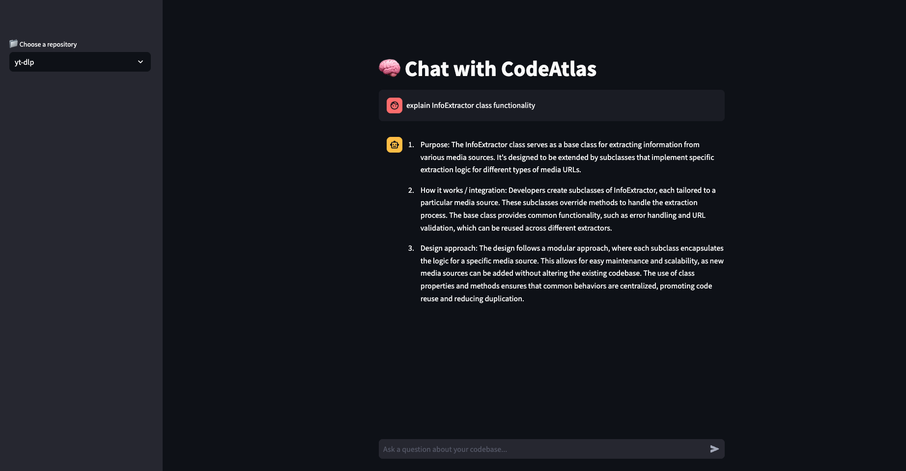
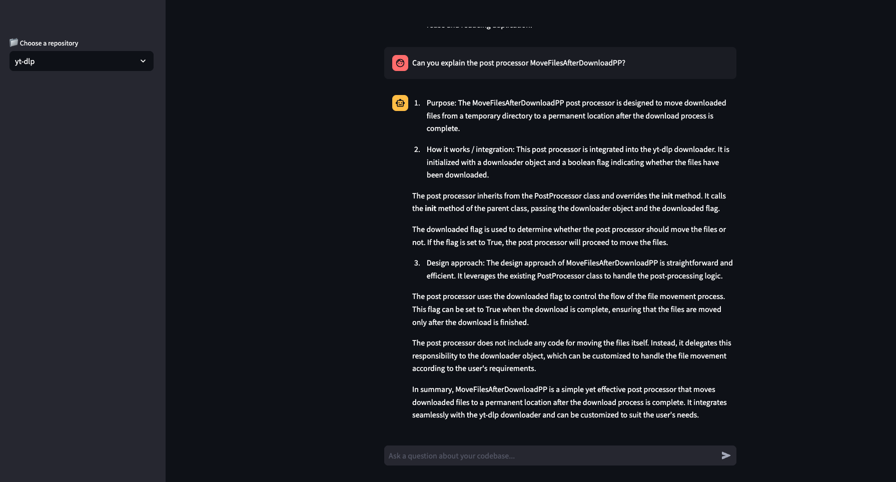

# 🧭 CodeAtlas: AI-Powered Codebase Explorer

> **Semantic code search and intelligent explanation engine**

CodeAtlas transforms how developers explore and understand complex codebases by combining cutting-edge AI embeddings with local LLM-powered explanations. Built for privacy, performance, and developer productivity.

***
## 🏆 Why CodeAtlas?

- Faster onboarding to complex codebases
- Intelligent code discovery without manual documentation
- Privacy-first approach with local processing
***

### &#128269; **Semantic Search**
- **BAAI bge-large-en-v1.5 embeddings**: State-of-the-art semantic understanding with 1024-dimensional vectors
- **FAISS-powered indexing**: Lightning-fast L2 distance similarity search
- **Intelligent chunking**: AST-based code parsing with contextual overlap for Python, JavaScript, Java, TypeScript, C++, C, Go

### 🧠 **AI-Powered Code Explanations**  
- **Local LLM integration**: Phi-3-mini for privacy-focused architectural insights
- **OpenAI (optional)**: GPT-3.5/4 integration for complex queries
- **Structured responses**: Developer-friendly explanations with Purpose, Integration, and Design sections
- **Hallucination-resistant**: Advanced prompt engineering ensures grounded, accurate responses

### 🔒 **Security & Privacy**
- **Fully local deployment**: Code never leaves your environment
- **Path traversal protection**: Security-hardened file system access
- **No external dependencies**: Complete offline operation capability
- **Incremental indexing**: Smart change detection with SHA-256 hashing

***

## 🚀 Quick Start

### Prerequisites
- Python 3.8+
- 8GB+ RAM recommended
- 5GB disk space for models

### Installation & Setup
```bash
# Clone the repository
git clone https://github.com/yourusername/codeatlas.git
cd codeatlas

# Install dependencies
pip install -r requirements.txt

# Configure environment
cp .env.example .env
# Edit .env with your settings:
# CODEATLAS_REPO_ROOT=/path/to/your/repositories
# EMBEDDING_MODEL_NAME=BAAI/bge-large-en-v1.5
# LLM_MODEL_NAME=microsoft/Phi-3-mini-4k-instruct
# CODEATLAS_EMBEDDER=huggingface
# CODEATLAS_CHAT_BACKEND=huggingface
# CODEATLAS_BACKEND_URL=http://localhost:8000
```

### Index Your Codebase
```bash
# Index a single repository
python scripts/run_pipeline.py /path/to/your/repo

# Or index all repos in CODEATLAS_REPO_ROOT
python scripts/init_db.py
```

### Start the API Server
```bash
# Launch FastAPI backend
uvicorn app.main:app --reload

# Launch Streamlit frontend (optional)
streamlit run streamlit_app.py
```

### Try It Out
```bash
# Visit the interactive API documentation
open http://localhost:8000/docs

# Use the Streamlit interface
open http://localhost:8501

# Or make direct API calls
curl -X POST "http://localhost:8000/chat?repo_name=your_repo" \
  -H "Content-Type: application/json" \
  -d '{"query": "explain the authentication system"}'
```

***

## 🏗️ Architecture Overview

**Core Workflow:**
1. **Crawl**: Secure file system traversal with path validation
2. **Parse**: Language-specific AST chunking with 5-line overlap
3. **Embed**: Transform to semantic vectors using BAAI bge-large-en-v1.5
4. **Index**: Store in FAISS with comprehensive metadata
5. **Search**: Natural language queries with L2 similarity scoring
6. **Explain**: Generate structured insights using local or cloud LLMs

[View architectural diagram in detail](docs/architecture.md)

***

## 📊 Performance & Capabilities

| Component | Specification | Details |
|-----------|---------------|---------|
| **Embedding Model** | BAAI/bge-large-en-v1.5 | 1024-dimensional vectors, multilingual |
| **Vector Database** | FAISS IndexFlatL2 | In-memory L2 distance search |
| **Code Languages** | 7 supported | Python, JS, Java, TS, C++, C, Go |
| **Security Features** | Path traversal protection | Prevents directory escape attacks |
| **Chunking Strategy** | AST-based + overlap | Context-aware code segmentation |
| **LLM Backends** | Dual support | Local Phi-3-mini + OpenAI (on config) |

***

## 💻 Usage Examples

### Basic Code Search
```python
# Find authentication logic
POST /chat?repo_name=my_project
{
  "query": "how does user authentication work"
}

# Response includes structured explanation:
# 1. Purpose: ...
# 2. How it works / integration: ...  
# 3. Design approach: ...
```
### Examples of queries from the UI



### Advanced Configuration
```python
# Environment variables in .env
CODEATLAS_EMBEDDER=huggingface
EMBEDDING_MODEL_NAME=BAAI/bge-large-en-v1.5
CODEATLAS_CHAT_BACKEND=huggingface  # or "openai"
LLM_MODEL_NAME=microsoft/Phi-3-mini-4k-instruct
CODEATLAS_REPO_ROOT=/path/to/repositories
```

***

## 🧪 Testing & Development

### Run Tests
```bash
# Install development dependencies
pip install pytest pytest-cov

# Run full test suite
pytest tests/ -v

# Run with coverage
pytest tests/ --cov=app --cov-report=html
```

***

## 🔧 Advanced Features

### Incremental Indexing
CodeAtlas automatically detects repository changes using SHA-256 hashing:
```python
# Automatic change detection
python scripts/init_db.py  # Only re-indexes changed repos
```

### Custom Chunking Strategies
- **Python**: AST-based class/function extraction with 5-line overlap
- **JavaScript/TypeScript**: Tree-sitter parsing for accurate scope detection  
- **Generic**: Sliding window chunking for unsupported languages

### Security Features
- Path traversal attack prevention
- Symlink filtering
- File size limits (2MB max)
- Hidden file exclusion

***

***

### Project Structure
```
codeatlas/
├── app/
    ├── api/          # FastAPI routes
    ├── services/     # Core business logic
    ├── models/       # Search response
    ├── core/         # Configuration & utilities
    └── utils/        # Helper functions
├── scripts/          # CLI tools & pipelines
├── tests/            # Comprehensive test suite  
├── frontend/         # Streamlit interface
└── requirements.txt  # Dependencies
```

***

***
## 🚀 Roadmap: Knowledge Graph & Flow Analysis

### Next Major Feature — Interactive Code Flow Understanding

We’re taking CodeAtlas beyond semantic search!  
The upcoming release will introduce **knowledge graph–based code flow analysis**, allowing developers to ask architectural questions like:

- *“Show me the complete authentication flow”*  
- *“Explain how payment processing works end-to-end”*  

### 🔑 Key Capabilities
- Visual flow diagrams of execution paths  
- Cross-module dependency tracking with interactive navigation  
- Impact analysis to understand change propagation  
- Architectural pattern recognition (design patterns, bottlenecks)  

This will evolve CodeAtlas into a **true architectural understanding system**, making it invaluable for onboarding, refactoring, and documenting complex system behaviors automatically.
***

## 📄 License

This project is licensed under the MIT License - see the [LICENSE](LICENSE) file for details.

***

## 🙏 Acknowledgments

- **BAAI** for the exceptional bge-large-en-v1.5 embedding model
- **Microsoft** for the efficient Phi-3-mini language model
- **Facebook Research** for FAISS vector similarity search
- **FastAPI** team for the excellent web framework
- **Streamlit** for the rapid prototyping interface


**⭐ Star this repo if CodeAtlas accelerated your code understanding!**

*Built with ❤️ for the developer community by developers who understand the pain of navigating complex codebases.*
