# CodeAtlas Architecture

## Overview
CodeAtlas consists of modular components to crawl, embed, index, and search codebases.

```mermaid
graph TD
    %% --- Data Ingestion Pipeline ---
    subgraph "Data Ingestion Pipeline"
        A[📂 Code Repositories] --> B[🕷️ Crawler<br/>File Discovery]
        B --> C[🌳 Chunker<br/>AST / Tree-sitter Parsing]
        C --> D[🧩 Embedder<br/>HuggingFace / OpenAI]
        D --> E[🗄️ Indexer<br/>FAISS Vector Store]
    end

    %% --- Search & Intelligence Layer ---
    subgraph "Search & Intelligence Layer"
        E --> F[🔍 Searcher<br/>Vector Similarity]
        F --> G[💬 Chat Service<br/>Context + LLM]
        G --> H[🤖 LLM Backends<br/>HF Transformers / OpenAI]
    end

    %% --- API & Interface Layer ---
    subgraph "API & Interface Layer"
        G --> I[⚡ FastAPI Endpoints<br/>Chat / Search / Repos]
        I --> J[🖥️ Streamlit Frontend<br/>Interactive UI]
    end

    %% --- Config & Dependencies ---
    subgraph "Configuration & Dependencies"
        K[⚙️ Settings<br/>.env Config] --> L[📦 Dependency Injection<br/>Cached Services]
        L --> G
        L --> F
        L --> D
    end

    %% --- Continuous Pipeline ---
    subgraph "Continuous Pipeline"
        M[🚀 Init Scripts<br/>Auto Indexing] --> N[♻️ Hash-based<br/>Change Detection]
        N --> B
    end

    %% --- Styles (High Contrast, Works on Dark/Light) ---
    style A fill:#4FC3F7,stroke:#0288D1,stroke-width:2px,color:#000
    style B fill:#BA68C8,stroke:#6A1B9A,stroke-width:2px,color:#fff
    style C fill:#BA68C8,stroke:#6A1B9A,stroke-width:2px,color:#fff
    style D fill:#81C784,stroke:#2E7D32,stroke-width:2px,color:#000
    style E fill:#81C784,stroke:#2E7D32,stroke-width:2px,color:#000
    style F fill:#FFB74D,stroke:#E65100,stroke-width:2px,color:#000
    style G fill:#E57373,stroke:#B71C1C,stroke-width:2px,color:#fff
    style H fill:#E57373,stroke:#B71C1C,stroke-width:2px,color:#fff
    style I fill:#BDBDBD,stroke:#424242,stroke-width:2px,color:#000
    style J fill:#F06292,stroke:#880E4F,stroke-width:2px,color:#fff
    style K fill:#EEEEEE,stroke:#616161,stroke-width:2px,color:#000
    style L fill:#EEEEEE,stroke:#616161,stroke-width:2px,color:#000
    style M fill:#4DB6AC,stroke:#00695C,stroke-width:2px,color:#000
    style N fill:#4DB6AC,stroke:#00695C,stroke-width:2px,color:#000


```

### Components
- **Crawler:** Recursively scans target repositories to find source code files, filters by extension (.py, .js, .java, .ts, .cpp, .c, .go), and excludes directories like .git, __pycache__, node_modules, and venv.

- **Chunker:** Extracts classes, functions, and overview chunks from source files using Python AST parsing or Tree-sitter for JavaScript, TypeScript, Java, Go, C, and C++, with overlapping context for better retrieval.

- **Embedder:** Converts code chunks into dense vector embeddings using either HuggingFace SentenceTransformer models or OpenAI embedding APIs (configurable backend).

- **Indexer:** Builds and maintains a FAISS vector index using L2 distance, storing embeddings with metadata (file path, line ranges, chunk type, chunk name).

- **Searcher:** Performs semantic vector similarity search on the FAISS index to find relevant code snippets based on query embeddings.

- **Chat Service:** Coordinates search results and context assembly, selects LLM backend (HuggingFace Transformers or OpenAI GPT) to generate developer-friendly responses.

- **API:** Implements FastAPI REST endpoints for chat queries, semantic search, and repository listing with dependency injection.

- **Frontend:** Streamlit web application providing an interactive chat interface for querying codebases.

## Technologies
- FastAPI for API
- HuggingFace SentenceTransformers for local embedding models for converting code to vectors (configurable model selection).
- OpenAI API for optional cloud-based embeddings (text-embedding-3-small) and conversational language models.
- FAISS for similarity search
- Optional Streamlit for frontend
- Tree-sitter for language-agnostic parser generator for extracting structured code chunks from multiple programming languages.
- Python AST for built-in Abstract Syntax Tree parser for precise Python code analysis.
